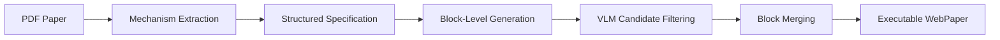

# PaperVoyager

**Building Interactive Web with Visual Language Models**

[](https://arxiv.org/abs/2603.22999)
[](#what-is-papervoyager)
[](#quick-start)

PaperVoyager is a **Paper-to-Interactive-System Agent** that transforms static research papers into executable, interactive web systems. Instead of converting a paper into another static artifact such as a summary, webpage, or slide deck, PaperVoyager aims to produce a runnable **WebPaper** where readers can manipulate inputs, observe state transitions, and explore the mechanisms described by the paper.

This repository contains the public code, prompts, benchmark utilities, and generated WebPaper artifacts associated with:

> Dasen Dai, Biao Wu, Meng Fang, Wenhao Wang.  
> **PaperVoyager: Building Interactive Web with Visual Language Models.**  
> arXiv:2603.22999v3, 2026.

## What Is PaperVoyager?

Technical papers often describe algorithms, systems, physical dynamics, or stateful mechanisms that are hard to understand through passive reading alone. PaperVoyager reframes paper understanding as **interactive exploration**:

1. **Parse the PDF** into a mechanism-aware representation.
2. **Identify core mechanisms** such as algorithmic steps, parameter-dependent behavior, state transitions, and component relationships.
3. **Generate a structured specification** that defines interactive modules, user controls, page layout, and expected visual behavior.
4. **Synthesize React/TypeScript web modules** through block-level generation.
5. **Filter and merge candidates** into a complete executable WebPaper.

The result is a single-page interactive web application that exposes the paper's dynamics directly in the browser.



## Paper Highlights

- **New task:** end-to-end paper-to-interactive-system synthesis.
- **Benchmark:** 19 representative research-paper topics across algorithms, data structures, distributed systems, mathematics, machine learning, physics, and systems.
- **Ground truth:** each task is paired with an expert-authored interactive web system.
- **Evaluation:** combines checklist matching for design compliance with interaction-based browser exploration for functional reliability.
- **Result:** PaperVoyager achieves the best average success rate reported in the paper, **80.7%**, outperforming strong baseline VLMs under the benchmark's 60/40 checklist-interaction scoring protocol.

## Repository Layout

```text
PaperVoyager/
├── generate_apps.py              # Baseline prompt-to-React/TypeScript generation
├── tools/
│   ├── block_pipeline/           # PaperVoyager block generation, rendering, scoring, merging
│   ├── build_portal.py           # Build a local portal over generated WebPapers
│   ├── build_all_tsx.py          # Batch build generated Vite projects
│   └── run_full_codegen_eval.py  # Benchmark/evaluation helpers
├── prompts/                      # Topic-conditioned WebPaper generation prompts
├── benchmark/                    # Benchmark evaluation and aggregation scripts
├── outputs/                      # Generated WebPaper source artifacts
├── docs/                         # Paper-aligned notes and repository documentation
└── .env.example                  # Local configuration template
```

## Quick Start

Create an environment and install dependencies:

```bash
python -m venv .venv
source .venv/bin/activate  # Windows: .venv\Scripts\activate
pip install -r requirements.txt
python -m playwright install chromium
```

Configure a code generation provider:

```bash
cp .env.example .env
# edit .env with your API key and model settings
```

Generate WebPaper apps from topic prompts:

```bash
python generate_apps.py --provider gemini --model gemini-2.0-flash-exp
```

Run the PaperVoyager block pipeline on selected topics:

```bash
python tools/block_pipeline/pipeline.py \
  --prompts Algorithm_Dynamic_Programming,ML_Gradient_Descent,Sys_Virtual_Memory \
  --gen-env-file .env \
  --merge-env-file .env \
  --out-base outputs/block_pipeline \
  --headless
```

Build a local browsing portal:

```bash
python tools/build_portal.py
python -m http.server 8000
```

Then open:

```text
http://localhost:8000/index.html
```

## Benchmark Topics

The benchmark contains 19 topics selected because their core mechanisms naturally support interactive representation.

| Abbrev. | Topic | Domain |
|---|---|---|
| Alg-DP | Dynamic Programming | Algorithms |
| Alg-GP | Graph Pathfinding | Algorithms |
| Alg-SR | Sorting Algorithms | Algorithms |
| DS-BT | Balanced BSTs | Data Structures |
| DS-HM | Hash Maps / Cuckoo Hashing | Data Structures |
| Dist-Raft | Raft Consensus | Distributed Systems |
| Math-Lorenz | Lorenz Attractor | Mathematics |
| Math-FFT | Fourier Series / FFT | Mathematics |
| Math-Eig | Eigendecomposition | Mathematics |
| Math-MC | Monte Carlo Estimation | Mathematics |
| ML-GD | Gradient Descent | Machine Learning |
| ML-KM | K-Means Clustering | Machine Learning |
| ML-NNV | Neural Net Backpropagation | Machine Learning |
| Phys-CFD | 2D Fluid Simulation | Physics |
| Phys-Orbit | N-body Gravity | Physics |
| Phys-Opt | Optics & Ray Tracing | Physics |
| Phys-Therm | Thermodynamics | Physics |
| Sys-Sched | CPU Scheduling | Systems |
| Sys-VM | Virtual Memory & Paging | Systems |

## Evaluation

The paper evaluates generated WebPapers with two complementary signals:

- **Checklist Matching Evaluation:** checks whether required visualization modules and interactive elements from the expert checklist are implemented.
- **Interactive Exploration Evaluation:** uses browser automation to interact with buttons, sliders, dropdowns, inputs, and canvas regions, then checks whether the page exhibits meaningful visible changes.

The final score reported in the paper combines these two branches with weights of **60%** and **40%**, respectively.

## Citation

If you find PaperVoyager useful, please cite:

```bibtex
@misc{dai2026papervoyager,
  title        = {PaperVoyager: Building Interactive Web with Visual Language Models},
  author       = {Dai, Dasen and Wu, Biao and Fang, Meng and Wang, Wenhao},
  year         = {2026},
  eprint       = {2603.22999},
  archivePrefix= {arXiv},
  primaryClass = {cs.CL},
  url          = {https://arxiv.org/abs/2603.22999}
}
```

## Notes

- This repository is intended for research and demonstration.
- Generated WebPaper outputs may require local dependency installation before building.
- Do not commit `.env` files or API keys. Use `.env.example` as the template.
